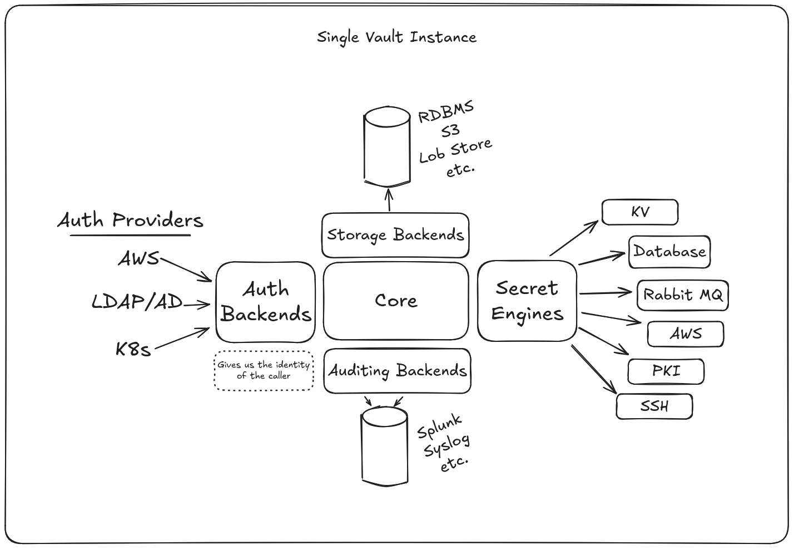

# What is Vault?
Vault is a tool used to address the secret management problem. And in doing so it would be helpful to define what is a secret?

## What are Secrets?
Secrets are anything that grants either authentication or authorization to a system:
- usernames and passwords
- DB credentials
- API tokens
- TLS certificates

These are all items we want to carefully manage. We need to understand who has access to them, who's been using them, and some way to periodically rotate them.

### Secret Sprawl
In practice we often see secret sprawl, meaning that they are strewn everywhere:
- plain text in source code
- configuration management(chef, puppet, ansible)
- VCS

When we are in this state it becomes very difficult to tell who has access to what, there is no audit trail to be able to see if a user or entity did access something, and there isn't a good way to perform rotations of credentials in response to a breach or for periodic rotations.

## What Value Does Vault Provide?

### Level 1 Challenge
With Vault, we move all of our secrets to a central location. Additionally it has the ability to encrypt everything inside of Vault and in transit between Vault and any of the clients that want to access it.

Vault also allows us to implement fine-grain access controls on top of this in addition to an audit log to keep track of which users and entities access what credentials.

This is the level 1 challenge that Vault addresses, moving from a world of secret sprawl to a central system that provides guarantees of:
- Encryption at rest and in transit
- Access controls
- Visibility and auditing

### Level 2 Challenge
At this point we have everything stored safely in Vault and now we thread the secrets out to applications, but the challenge here becomes that applications can easily leak those secrets.
- Apps may log the credentials to a logging system
- secrets may show up in diagnostic outputs, tracebacks, or error reports

To address this level 2 challenge Vault introduces dynamic secrets. The idea behind this is that instead of providing long lived credentials to applications that will eventually leak them, we provide short lived ephemeral credentials. This provides us with a few benefits:
- Credentials are only valid for a bounded period of time, creating a moving target for an attacker
- Each credential is unique to each client which provides a few benefits
  - With unique credentials we can pinpoint exactly where a breach occurred
  - This also lets us revoke just the secrets for that individual client rather than all clients of that type.

### Level 3 Challenge
The third challenge is that applications are often storing data and they need a way to effectively protect that data at rest. We can't store all of the information within Vault, it is meant just to manage secrets not any data that might be confidential.

To address this people will often store encryption keys within Vault and distribute that key out to applications which use that key to perform cryptography at rest. However, there are lots subtle nuances to doing this process correctly and when it is not implemented correctly it often compromises whole cryptography process.

To address this Vault offers something called Encrypt as a Service. So instead of just delivering a key to a developer and expecting them to implement cryptography correctly Vault will do a few things:
- Allows you to create a set of named keys, these are just names and the values themselves aren't given out
- Exposes a set of high level APIs to do cryptography(encrypt, sign, or verify)
- Now developers can call Vault with an API and do something like HMAC(<key>, <some data>).
  - This provides developers with vetted implementations of various high level operations
  - It also lets us offload the key management to Vault, this includes key versioning, key rotations, key decommissioning and the full life-cycle of key management using high level APIs that Vault provides.

To summarize, Vault helps applications protect their own data at rest through a series of high level key management and cryptographic offload.

## Vault - High Level Architecture
There are a few important things to remember about Vault's architecture, first is that it is highly pluggable with many different plugin mechanisms.

The central core has many responsibilities including the life cycle management ensuring that requests are processed properly. And around it there are many different extension points that allow us to integrate it into our environment.

The authentication backend allows clients to authenticate from different systems using various providers like AWS, LDAP/AD, K8s, etc. What we get out from this is a notion of the identity of the caller.

We use that to connect to an auditing backend which allows us to connect and stream out request/response auditing to external systems to give us a trail of who has done what.

To store Vaults own data at rest we make use of storage backends. This could be a standard RDBMS, S3, Consul, etc. The goal of these backend systems is to provide a backend storage that is highly available so we can tolerate the loss of one of these backend systems.

The last bit are the secret engines which come in many different forms, the biggest use of these is to enable the dynamic secret capabilities mentioned earlier.

At it's core this is what makes Vault so flexible: 
- It can manage clients that are authenticating from a wide variety of identity providers.
- We can stream audit information to a variety of different trusted logging systems
- We can store data in almost any durable system
- And we can manage a variety of different static or dynamic secrets using different secret engines.
