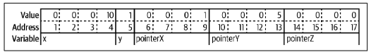
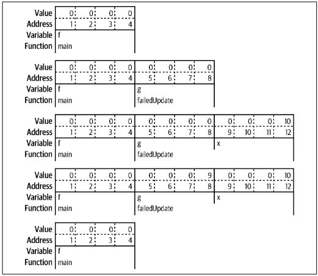
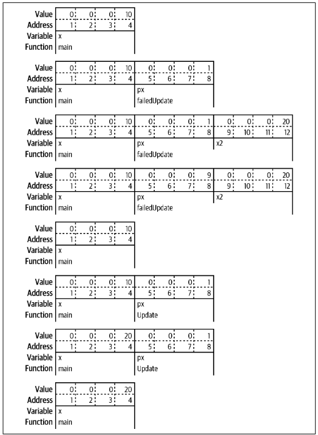
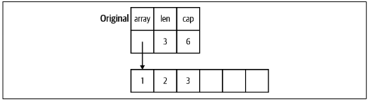
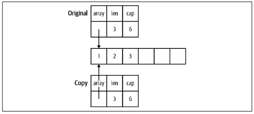
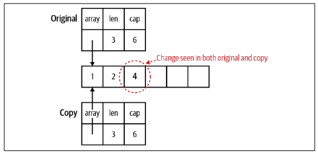
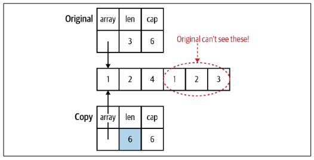
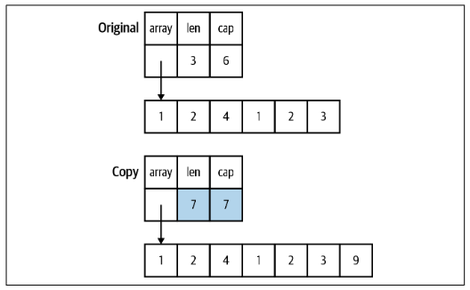

# Pointers

<!--toc:start-->
- [Pointers](#pointers)
  - [Pointers Indicate Mutable Parameters](#pointers-indicate-mutable-parameters)
  - [Pointers Are a Last Resort](#pointers-are-a-last-resort)
  - [The Difference Between Maps and Slices](#the-difference-between-maps-and-slices)
<!--toc:end-->

A pointer is a variable that contains the address where another variable is stored:
```go
var x int32 = 10
var y bool = true
pointerX := &x
pointerY := &y
var pointerZ *string
```


While different types of variables can take up different numbers of memory locations, every pointer, no matter what type it is pointing to, is always the same number of memory locations as seen in the example above.

The zero value for a pointer is `nil`. We've seen this before as the zero value for slices, maps, and functions. All these types are implemented with pointers(channels and interfaces are also implemented with pointers). Unlike `NULL` in C, `nil` is not another name for 0; `nil` is an untyped identifier that represents the lack of a value.

The `&` is the *address* operator. It precedes a value type and returns the address where the value is stored:
```go
x := hello
pointerToX := &x
```

The `*` is the *indirection* operator. It precedes a variable of pointer type and returns the pointed-to value. This is called *dereferencing*:
```go
x := hello
pointerToX := &x
fmt.Println(pointerToX)  // A memory address
fmt.Println(*pointerToX) // 10
z := 5 + *pointerToX
fmt.Println(z) // 15
```

Before dereferencing a pointer, you must make sure that the pointer is non-nil. Your program will panic if you attempt to dereference a `nil` pointer:
```go
var x *int
fmt.Println(x == nil) // true
fmt.Println(*x)       // panics
```

A *pointer type* is a type that represents a pointer. It is written with a `*` before a type name.

For structs, use an `&` before a struct literal to create a pointer instance. You can't use an `&` before a primitive literal(numbers, booleans, and strings) or a constant because they don't have memory addresses and they exist only at compile time:
- When we say primitive values don't have memory addresses, we're referring to how these values are handled by the compiler and at runtime. In many programming languages, including Go, primitive values are often treated differently from complex types like structs or slices.
  - Complex types typically have a definite location in memory where their data is stored. 
  - Primitive values might be stored in CPU registers, inlined into the machine code, or handled in other optimized ways.
- This optimization is done because primitive values are small and frequently used so treating them like full-fledged objects with memory addresses would be inefficient.

When you need a pointer to a primitive type, declare a variable and point to it:
```go
x := &Foo{}
var y string
z := &y
```

If you have a struct with a field of a pointer to a primitive type, you can't assign a literal directly to the field for the reasons discussed above:
```go
type person struct {
  Firstname  string
  MiddleName *string
  LastName   string
}

p := person{
  Firstname:  "Pat",
  MiddleName: "Perry", // cannot use "Perry" (untyped string constant) as *string value in struct literal
  LastName:   "Peterson",
}
```

If you try putting an `&` before `"Perry"`, you'll get the following error: `invalid operation: cannot take address of "Perry" (untyped string constant)`

There are two ways around this problem. The first is to do what we've seen before which is to introduce a variable to hold the constant value. The second is to write a generic helper function that takes in a parameter of any type and returns a pointer to that type:
```go
func makePointer[T any](t T) *T {
	return &t
}
...
p := person{
  Firstname:  "Pat",
  MiddleName: makePointer("Perry"), // This works
  LastName:   "Peterson",
}
```

This works because passing a constant to a function creates a copy and assigns it to the parameter which is a variable. And since it's a variable, it has an address in memory which we return from the function.

## Pointers Indicate Mutable Parameters
Since Go is a call-by-value language, the values passed to functions are copies. For non-pointer types like primitives, structs, and arrays, this means that the called function cannot modify the original.

When a pointer is passed to a function, the function gets a copy of the pointer. This still points to the original data, which means that the original data can be modified by the called function.

The first implication of this is that when you pass a `nil` pointer to a function, you cannot make the value non-nil. This might be confusing at first, but it makes sense. Since the memory location was passed to the function via call-by-value, you can't change the memory address, any more than you could change the value of an `int` parameter. Here is an example:
```go
func failedUpdate(g *int) {
	x := 10
	g = &x
}

func main() {
	var f *int // f is nil
	failedUpdate(f)
	fmt.Println(f) // nil
}
```

The flow of this code is shown below:


The second implication of copying a pointer is that if you want the value assigned to a pointer parameter to still be there when you exit the function, you must dereference the pointer and set the value. If you change the pointer, you have changed the copy, not the original. De-referencing puts the new value in the memory location pointed to by both the original and the copy:
```go
func failedUpdate(px *int) {
	x2 := 20
	px = &x2
}

func update(px *int) {
	*px = 20
}

func main() {
	x := 10
	failedUpdate(&x)
	fmt.Println(x) // 10
	update(&x)
	fmt.Println(x) // 20
}
```

The flow of this code is shown below


## Pointers Are a Last Resort
We should be careful about when we use pointers in Go. They make it harder to understand data flow and can create extra work for the garbage collector. For example, rather than populating a struct by passing a pointer to it into a function, we have the function instantiate and return the struct:
```go
// Don't do this
func MakeFoo1(f *Foo) error {
	f.Field1 = "val"
	f.Field2 = 20
	return nil
}

// Do this
func MakeFoo2() (Foo, error) {
	f := Foo{
		Field1: "val",
		Field2: 20,
	}
	return f, nil
}
```

The only time you should use pointer parameters to modify a variable is when the function expects an interface.

When returning values from a function you should favor value types. Use a pointer type as a return type only if there is state within the data type that needs to be modified.

## The Difference Between Maps and Slices
Now that we know a little about pointers we can understand why modifications made to a map that's passed to a function are reflected in the original variable. Within the Go runtime, a map is implemented as a pointer to a struct.

Passing a slice to a function has more a complicated behavior: any modification to the slice's contents is reflected in the original variable, but using `append` to change the length isn't reflected in the original variable even if the slice has a capacity greater than its length. This is because a slice is implemented as a struct with three fields: two `int` fields for length and capacity and a pointer to a block of memory.



When a slice is copied to a different variable or passed to a function, a copy is made of the length, capacity, and the pointer:



Changing the values in the slice changes the memory that the pointer points to, so the changes are seen in both the copy and original:



If the slice copy is appended to and there is enough capacity in the slice for new values, the length changes in the copy, and the new values are stored in the block of memory that's shared. However, the length in the original slice remains unchanged. The Go runtime prevents the original slice from seeing those values since they are beyond the length of the original slice:



If the slice copy is appended to and there isn't enough capacity a new bigger block of memory is allocated, values are copied over, and the length, capacity, and pointer fields in the copy are updated. These changes are not reflected in the original:



Slices are frequently passed around in Go programs and by default you should assume that a slice is not modified by a function. If your function does modify a slice this should be specified in your function's documentation.

The ability to modify the contents(but not the size) of a slice input parameter makes them ideal for use as a reusable buffer.

## Slices as Buffers
